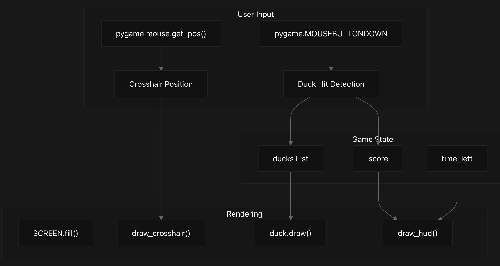

# $${\color{green} Duck-Hunter-Game }$$	

Classic game of Duck Hunter coded in Python. Runs locally. 

# $${\color{green} Overview }$$
## Purpose and Scope
This document provides a comprehensive introduction to the Duck Hunter game, a simple hunting simulation where players aim and shoot at ducks to earn points within a time limit. This overview explains the game concept, its core components, gameplay mechanics, and the high-level structure of the codebase. This code is a simple duck hunting game where the player clicks on ducks to score points. The game features a mallard duck design, a crosshair for aiming, and a HUD displaying the score and time left. The game ends after a set duration, and the final score is displayed. The game is implemented using Pygame, a popular library for creating games in Python. The code includes classes and functions for managing the game state, drawing graphics, and handling user input.

## Game Concept
Duck Hunter is a classic arcade-style hunting game implemented in Python using the Pygame library. Players use their mouse to aim a crosshair at mallard ducks flying across the screen. When a player successfully clicks on a duck, they earn a point and the duck is removed from the game. The game runs for a fixed duration (30 seconds by default), after which the player's final score is displayed.

## Core Components
The Duck Hunter game consists of several key components that work together to create the gameplay experience:

## Game Execution Flow
The following sequence diagram illustrates how the game progresses from initialization to completion:

## Game Mechanics

### Duck Behavior
Ducks in the game follow a simple behavior pattern:

1. Ducks spawn at the left edge of the screen at random heights
2. Each duck moves horizontally across the screen at a randomly assigned speed
3. Ducks that reach the right edge of the screen are removed from the game
4. New ducks are randomly spawned throughout gameplay
5. When clicked, a duck is removed and the player's score increases

Player Interaction
Players interact with the game primarily through mouse movements and clicks:

1. Moving the mouse controls the position of the crosshair on screen
2. Clicking the left mouse button attempts to shoot a duck
3. If the click position intersects with a duck's hitbox, the duck is registered as hit
4. After the game ends, players can press 'R' to restart or 'Q' to quit

## Technical Implementation
### Code Structure
The Duck Hunter game is implemented in a single Python file, with the following key elements:

Component	Description	Location
Initialization	Sets up Pygame, screen dimensions, colors, and game settings	
README.md
10-35
Duck Class	Defines duck appearance, movement, and rendering	
README.md
37-72
Utility Functions	Functions for drawing the crosshair and HUD	
README.md
75-87
Game Loop	Main game logic, controls game flow	
README.md
90-131
Main Function	Program entry point, handles game restart/quit	
README.md
133-157

### Data Flow
The following diagram illustrates how data flows through the Duck Hunter game system:

### Visual Elements
The game features several key visual elements:

1. Mallard Duck: A stylized duck drawn using ellipses, circles, and polygons to create a recognizable silhouette
2. Crosshair: A red crosshair that follows the player's mouse position
3. Background: A sky blue background representing the sky
4. HUD (Heads-Up Display): Text displaying the current score and time remaining

### Running the Game
To play Duck Hunter, you need Python installed with the Pygame library. The game runs at 60 frames per second and has a default duration of 30 seconds. 

# $${\color{green} Code }$$
Copy & run the notebook below to play

        
            import pygame
            import sys
            import random
            
            # Initialize Pygame
            pygame.init()
            
            # Screen dimensions
            WIDTH, HEIGHT = 800, 600
            SCREEN = pygame.display.set_mode((WIDTH, HEIGHT))
            pygame.display.set_caption('Duck Hunter (Mallard Edition)')
            
            # Colors
            WHITE = (255, 255, 255)
            BLACK = (0, 0, 0)
            SKY_BLUE = (135, 206, 235)
            MALLARD_BODY = (139, 69, 19)       # Brown chest
            MALLARD_WING = (200, 200, 200)     # Grey body
            MALLARD_HEAD = (0, 128, 0)         # Green head
            MALLARD_BILL = (255, 215, 0)       # Yellow bill
            CROSSHAIR_COLOR = (200, 0, 0)
        
            # Game settings
            FPS = 60
            DUCK_WIDTH, DUCK_HEIGHT = 60, 45
            GAME_DURATION = 30  # seconds
            
            class Duck:
                def __init__(self):
                    x = -DUCK_WIDTH
                    y = random.randint(50, HEIGHT - 100)
                    speed = random.uniform(2, 5)
                    self.rect = pygame.Rect(x, y, DUCK_WIDTH, DUCK_HEIGHT)
                    self.speed = speed
        
            def move(self):
                self.rect.x += self.speed
        
            def draw(self, screen):
                body = self.rect
                pygame.draw.ellipse(screen, MALLARD_WING, body)  # body
                chest = pygame.Rect(
                    body.x + int(body.width * 0.1),
                    body.y + int(body.height * 0.4),
                    int(body.width * 0.5), int(body.height * 0.4)
                )
                pygame.draw.ellipse(screen, MALLARD_BODY, chest)  # chest
                head_center = (
                    body.x + int(body.width * 0.8),
                    body.y + int(body.height * 0.3)
                )
                pygame.draw.circle(screen, MALLARD_HEAD, head_center, int(body.height * 0.35))  # head
                pygame.draw.circle(
                    screen, WHITE,
                    (head_center[0] - int(body.height * 0.05), head_center[1]),
                    int(body.height * 0.2), 3
                )  # neck ring
                bill = [
                    (head_center[0] + int(body.height * 0.35), head_center[1]),
                    (head_center[0] + int(body.height * 0.5), head_center[1] - int(body.height * 0.1)),
                    (head_center[0] + int(body.height * 0.5), head_center[1] + int(body.height * 0.1))
                ]
                pygame.draw.polygon(screen, MALLARD_BILL, bill)  # bill
        
        
            def draw_crosshair(screen, pos):
                x, y = pos
                length = 20
                pygame.draw.line(screen, CROSSHAIR_COLOR, (x - length, y), (x + length, y), 2)
                pygame.draw.line(screen, CROSSHAIR_COLOR, (x, y - length), (x, y + length), 2)
                pygame.draw.circle(screen, CROSSHAIR_COLOR, pos, length, 1)
            
            
            def draw_hud(screen, score, time_left, font):
                score_text = font.render(f"Score: {score}", True, BLACK)
                time_text = font.render(f"Time: {int(time_left)}", True, BLACK)
                screen.blit(score_text, (10, 10))
                screen.blit(time_text, (WIDTH // 2 - time_text.get_width() // 2, 10))
            
            
            def game_loop():
                clock = pygame.time.Clock()
                font = pygame.font.SysFont('Arial', 32)
                score = 0
                start_ticks = pygame.time.get_ticks()
                ducks = [Duck()]
        
            while True:
                dt = clock.tick(FPS) / 1000
                elapsed = (pygame.time.get_ticks() - start_ticks) / 1000
                time_left = GAME_DURATION - elapsed
        
                for event in pygame.event.get():
                    if event.type == pygame.QUIT:
                        pygame.quit()
                        sys.exit()
                    if event.type == pygame.MOUSEBUTTONDOWN and event.button == 1:
                        mx, my = pygame.mouse.get_pos()
                        for duck in ducks[:]:
                            if duck.rect.collidepoint(mx, my):
                                score += 1
                                ducks.remove(duck)
                                break
        
                if time_left <= 0:
                    return score
        
                if random.random() < 0.01:
                    ducks.append(Duck())
        
                for duck in ducks[:]:
                    duck.move()
                    if duck.rect.x > WIDTH:
                        ducks.remove(duck)
        
                SCREEN.fill(SKY_BLUE)
                for duck in ducks:
                    duck.draw(SCREEN)
                draw_crosshair(SCREEN, pygame.mouse.get_pos())
                draw_hud(SCREEN, score, time_left, font)
                pygame.display.flip()
        
        
            def main():
                font = pygame.font.SysFont('Arial', 32)
                while True:
                    score = game_loop()
        
                # Game Over menu
                SCREEN.fill(BLACK)
                over_text = font.render(f"Game Over! Score: {score}", True, WHITE)
                retry_text = font.render("Press R to Retry or Q to Quit", True, WHITE)
                SCREEN.blit(over_text, (WIDTH // 2 - over_text.get_width() // 2, HEIGHT // 2 - 40))
                SCREEN.blit(retry_text, (WIDTH // 2 - retry_text.get_width() // 2, HEIGHT // 2 + 10))
                pygame.display.flip()
        
                waiting = True
                while waiting:
                    for event in pygame.event.get():
                        if event.type == pygame.QUIT:
                            pygame.quit()
                            sys.exit()
                        if event.type == pygame.KEYDOWN:
                            if event.key == pygame.K_r:
                                waiting = False  # restart loop
                            if event.key == pygame.K_q:
                                pygame.quit()
                                sys.exit()
        
        
            if __name__ == '__main__':
                main()
        
        

